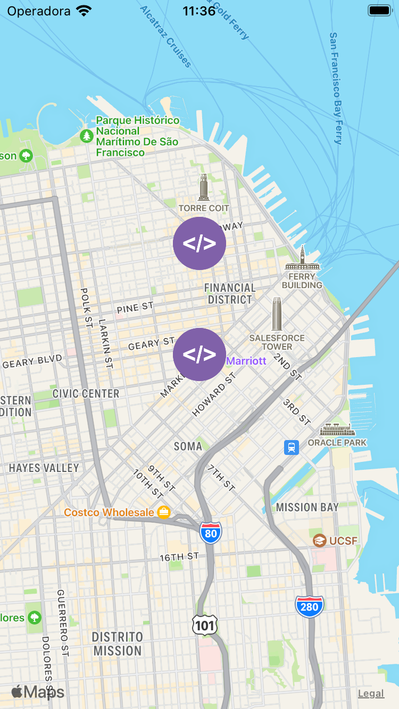
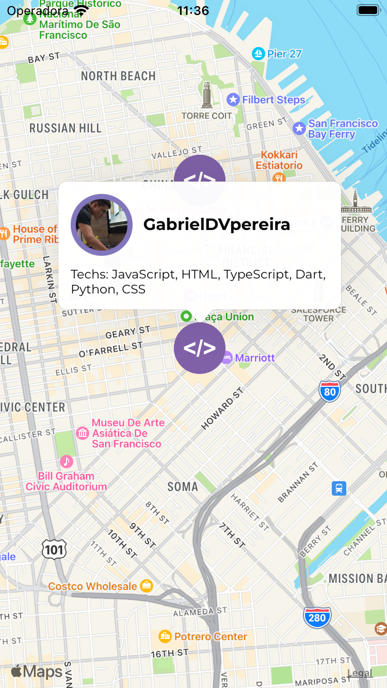

# FindDev_MVC

[](https://codecov.io/github/TCC-Gabriel-Danillo/FindDev_MVC)
[](https://sonarcloud.io/summary/new_code?id=TCC-Gabriel-Danillo_FindDev_MVC)
[](https://sonarcloud.io/summary/new_code?id=TCC-Gabriel-Danillo_FindDev_MVC)
[](https://sonarcloud.io/summary/new_code?id=TCC-Gabriel-Danillo_FindDev_MVC)
[](https://sonarcloud.io/summary/new_code?id=TCC-Gabriel-Danillo_FindDev_MVC)
[](https://sonarcloud.io/summary/new_code?id=TCC-Gabriel-Danillo_FindDev_MVC)
[](https://sonarcloud.io/summary/new_code?id=TCC-Gabriel-Danillo_FindDev_MVC)
[](https://sonarcloud.io/summary/new_code?id=TCC-Gabriel-Danillo_FindDev_MVC)
[](https://sonarcloud.io/summary/new_code?id=TCC-Gabriel-Danillo_FindDev_MVC)
[](https://sonarcloud.io/summary/new_code?id=TCC-Gabriel-Danillo_FindDev_MVC)
[](https://sonarcloud.io/summary/new_code?id=TCC-Gabriel-Danillo_FindDev_MVC)


### Encontre incríveis desenvolvedores próximos a você. 

Esse é um aplicativo destinado para comunidade de desenvolvedores encontrar outros desenvolvedores próximos. 

<div style="display: flex; flex-direction: row; margin: 0 0 50px 0">
   
   
   
</div>


### Requisitos

- Instalar o expo local e em seu smatphone [Expo](https://expo.dev/)
- Configurar um projeto no [firebase](https://firebase.google.com/)
- Configurar um app no [github apps](https://docs.github.com/en/developers/apps/building-github-apps/creating-a-github-app)

### Configucação

Adicione na pasta src/View o arquivo .env com as seguintes informações

```
# GITHUB
GIT_CLIENT_SECRET=
GIT_CLIENT_ID=
GIT_AUTHORIZATION_ENDPOINT=
GIT_TOKEN_ENDPOINT=
GIT_REVOCATION_ENDPOINT=

# FIREBASE
FIREBASE_API_KEY=
FIREBASE_AUTH_DOMAIN=
FIREBASE_PROJECT_ID=
FIREBASE_STORAGE_BUCKET=
FIREBASE_MESSAGING_SENDER_ID=
FIREBASE_APP_ID=
FIREBASE_MEASUREMENT_ID=

# GENEREAL
APP_SCHEME=
```

### Executar

Para executar o projeto, basta entrar na pasta src/View e executar o seguinte comando

```
  expo start
```
